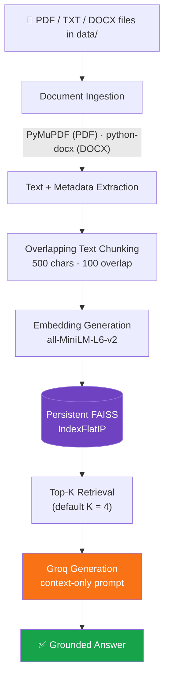
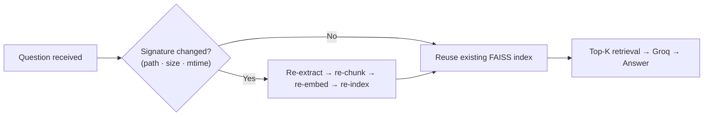

<div align="center">

### Enterprise-grade Retrieval-Augmented Generation for your local document library

*Ask questions in plain English. Get answers grounded only in your own PDF, TXT, and DOCX files — never hallucinated, always traceable.*


[Overview](#overview) • [Architecture](#system-architecture) • [Quick Start](#quick-start) • [Configuration](#configuration) • [API](#api-reference) • [Roadmap](#roadmap)

</div>

---

## Overview

**Document Atlas** is a self-hosted, Django-based RAG (Retrieval-Augmented Generation) service. It indexes local documents into a FAISS vector store, retrieves the most relevant passages for a given question, and asks a Groq-hosted LLM to answer **using only that retrieved context** — nothing else. The result is a lightweight internal Q&A engine with a low operational footprint: no managed vector database, no external embedding API, and no cloud dependency beyond the LLM call itself.

The included knowledge base ships with `Computer-Network-Notes-complete.pdf` and `Notes.pdf` so the system is queryable out of the box.

### Why Document Atlas

| | Document Atlas | Typical cloud RAG stack |
|---|---|---|
| Vector database | Local FAISS, file-based | Managed/remote (e.g. Pinecone, Weaviate) |
| Embeddings | Local `sentence-transformers` model | Third-party embedding API |
| Re-indexing | Automatic, signature-based, incremental | Often manual or externally orchestrated |
| Infra dependencies | Django + local disk | Multiple managed services |
| Best fit | Small-to-mid, single-tenant document sets | Large-scale, multi-tenant deployments |

---

## Key Features

| | Feature | Description |
|---|---|---|
| 🔍 | **Grounded answers** | The model is instructed to answer strictly from retrieved passages, with an explicit fallback when context is insufficient. |
| 📄 | **Multi-format ingestion** | PDF, TXT, and DOCX supported natively. |
| ⚡ | **Incremental indexing** | File signature (path, size, modified time) determines whether re-indexing is needed — unchanged files are skipped. |
| 🧠 | **Local embeddings** | `sentence-transformers/all-MiniLM-L6-v2`, loaded from local cache — no embedding API calls or per-query network cost. |
| 🗄️ | **Local, persistent vector store** | FAISS `IndexFlatIP`, written to disk between runs. |
| 🌐 | **Dual interface** | Web UI / REST endpoint and a terminal command, sharing the same pipeline. |
| 🧩 | **Traceable retrieval** | Every chunk keeps its filename, page number, and a stable `filename::p<page>::c<chunk>` ID. |

---

## Tech Stack

| Layer | Technology | Version | Purpose |
|---|---|---|---|
| Runtime | Python | 3.12 | Application runtime |
| Web framework | Django | `>=5.0,<6.0` | Web app, routing, API |
| Configuration | python-dotenv | `>=1.0.1` | Environment variable loading |
| PDF parsing | PyMuPDF | `>=1.24.9` | PDF text extraction |
| DOCX parsing | python-docx | `>=1.1.2` | DOCX text extraction |
| Embeddings | sentence-transformers | `>=3.2.1` | Text & query vectorization |
| Vector search | FAISS CPU | `>=1.8.0` | Local similarity search |
| LLM inference | Groq Python SDK | `>=0.9.0` | Grounded answer generation |
| Testing | pytest | `>=8.3.2` | Test runner |
| Testing | pytest-django | `>=4.8.0` | Django test integration |

---

## System Architecture



### Indexing decision flow



### Persistence layer

| File | Purpose |
|---|---|
| `vectorstore/faiss_index.index` | Persisted FAISS vector index |
| `vectorstore/metadata.json` | Chunk-level metadata (filename, page, chunk ID) |
| `vectorstore/document_state.json` | File signatures used to detect changes and skip unnecessary re-indexing |

---

## How It Works

### 1. Ingestion
- **PDFs** are extracted **page by page** via PyMuPDF, preserving page numbers.
- **TXT / DOCX** files are each treated as a **single source page** (the extraction layer does not preserve their visual page boundaries).

### 2. Chunking

| Parameter | Value |
|---|---|
| Chunk size | 500 characters |
| Chunk overlap | 100 characters |
| Step size | 400 characters |

Whitespace is normalized before every source page is split. The 100-character overlap preserves context across chunk boundaries while keeping chunks small enough for targeted retrieval. Every chunk is assigned a stable ID:

```
filename::p<page>::c<chunk>
```

> **Design trade-off:** chunking is a fixed character window, not semantic or sentence-aware — simple, fast, and predictable, at the cost of occasionally splitting mid-sentence.

### 3. Embedding & Retrieval
- **Model:** `sentence-transformers/all-MiniLM-L6-v2`, loaded from local cache (`local_files_only=True`)
- **Store:** FAISS `IndexFlatIP` (inner-product similarity)
- **Retrieval:** top `TOP_K` matches (default `4`) — **no fixed similarity threshold**; grounding is enforced by the generation prompt rather than a score cutoff

### 4. Generation
Retrieved chunks are passed to Groq as the **only** context available to the model. If context is insufficient, or generation fails, the app returns a document-only "unknown answer" fallback instead of guessing.

---

## Quick Start

### Prerequisites

| Requirement | Notes |
|---|---|
| Python 3.12 | Matches the project's tested environment |
| Groq API key | [console.groq.com](https://console.groq.com/) |
| Git | To clone the repository |

### 1 · Clone

```powershell
git clone <repository-url>
cd document_qa_bot
```

### 2 · Create a virtual environment

```powershell
python -m venv venv
.\venv\Scripts\Activate.ps1
```

### 3 · Install dependencies

```powershell
pip install -r requirements.txt
```

### 4 · Configure environment variables

```powershell
Copy-Item .env.example .env
```

Open `.env` and set `GROQ_API_KEY`.

> ⚠️ **Never commit `.env`.** Never place a real API key in `.env.example` or this README.

### 5 · Add your documents

Place `.pdf`, `.txt`, or `.docx` files into `data/`. Two example PDFs are included by default.

### 6 · Index & query

Indexing is automatic on first use — there is no separate indexing command:

```powershell
python manage.py ask_rag "What is a computer network?"
```

### 7 · Run the server

```powershell
python manage.py runserver
```

Open **http://127.0.0.1:8000/** and start asking questions.

---

## Configuration

| Variable | Required | Default | Description |
|---|---|---|---|
| `DJANGO_SECRET_KEY` | No | dev fallback | Set a unique value before deploying to production. |
| `DEBUG` | No | off | Enables debug mode when `True`, `1`, `yes`, or `on`. |
| `GROQ_API_KEY` | **Yes** | — | Required for generated answers. Keep private. |
| `GROQ_MODEL` | No | `openai/gpt-oss-20b` | Groq model used for generation. |
| `TOP_K` | No | `4` | Number of FAISS matches retrieved per query. |
| `RAG_DEBUG` | No | enabled | Toggles detailed RAG pipeline logging. |

`.env.example`:

```dotenv
GROQ_API_KEY=your_groq_api_key_here
```

---

## Usage

<table>
<tr><td width="33%" valign="top">

**Web interface**

1. `python manage.py runserver`
2. Open `http://127.0.0.1:8000/`
3. Ask your question

</td><td width="33%" valign="top">

**Terminal / CLI**

```powershell
python manage.py ask_rag "What is TCP?"
```

</td><td width="33%" valign="top">

**REST API**

```
POST /ask/
```

</td></tr>
</table>

## API Reference

### `POST /ask/`

**Request** (form field or JSON body):

```json
{
  "question": "What is a client-server network?"
}
```

**Response:** the current question paired with its generated, context-grounded answer. If retrieval yields insufficient supporting context, the fallback "unknown answer" response is returned instead of a generated one.

---

## Project Structure

```text
document_qa_bot/
├── data/                        # Source documents (PDF, TXT, DOCX)
├── vectorstore/
│   ├── faiss_index.index        # Persisted FAISS vector index
│   ├── metadata.json            # Chunk metadata (filename, page, chunk ID)
│   └── document_state.json      # File signatures for change detection
├── manage.py                    # Django entrypoint (includes ask_rag command)
├── .env.example                 # Environment variable template
├── requirements.txt             # Python dependencies
└── README.md
```

---

## Testing

```powershell
pytest
```

Runs the `pytest` + `pytest-django` suite covering ingestion, chunking, retrieval, and API behavior.

---

## Sample Questions

| Question | Expected Answer Topic |
|---|---|
| `What is a computer network?` | Definition of a computer network and its connected components |
| `What are the advantages of a computer network?` | Benefits such as file/resource sharing |
| `What is a client-server network?` | Client-server authentication, centralization, and administration |
| `What is TCP?` | Reliable, connection-oriented data transmission |
| `What is the difference between a datagram network and a virtual circuit network?` | How packet forwarding differs between the two network types |
| `What is quantum computing?` | **Fallback response** — out of scope, no supporting context in the indexed documents |

---

## Known Limitations

- DOCX and TXT documents are represented as a single source page — the extraction layer does not preserve their visual page boundaries
- Chunking is fixed to character windows; no semantic or sentence-aware splitting
- The embedding model must already exist in the local model cache, since requests use `local_files_only=True`
- Answer quality is bounded by text-extraction fidelity and the content of the indexed documents
- FAISS retrieval is local and flat — appropriate for a small corpus, but has no remote database, authentication, or multi-user isolation
- Generation requires Groq availability, a valid API key, and a reachable configured model; failures fall back to the document-only unknown-answer response
- Change detection relies on file path, size, and modification time, not content hashing

---

## Roadmap

- [ ] Semantic / sentence-aware chunking
- [ ] Additional file types (Markdown, HTML, CSV)
- [ ] Multi-user authentication and document isolation
- [ ] Configurable similarity-score threshold for retrieval
- [ ] Pluggable vector-store backends (e.g. pgvector, Qdrant)
- [ ] Streaming answer generation in the web UI
- [ ] Content-hash-based change detection

---

## Contributing

1. Fork the repository and create a feature branch
2. Make focused, atomic commits with clear messages
3. Add or update `pytest` coverage for any behavior change
4. Open a pull request describing the change and its motivation

Please don't commit secrets, `.env` files, or large binary documents to `data/` on shared branches.

---

## Security

- Never commit `.env` or real API keys to version control
- Rotate `GROQ_API_KEY` immediately if it is ever exposed
- There is no built-in authentication layer — do not expose the web interface to the public internet without adding one
- Report security concerns privately to the maintainers rather than through public issues

---

## FAQ

**Does this send my documents to an external service?**
Only retrieved passages (not full documents) are sent to Groq at query time, as context for generation. Embeddings are computed locally.

**What happens if I ask something outside my documents?**
The system returns a document-only fallback response rather than an unsupported or hallucinated answer — see the `quantum computing` example above.

**Do I need to re-run indexing manually after adding a file?**
No. Indexing is automatic and incremental — new or changed files are detected and re-indexed the next time a question is asked.

---

## Support

Open an issue in the repository with:
- Steps to reproduce
- Expected vs. actual behavior
- Relevant logs, with secrets redacted

---

## License

*No license has been specified for this project yet. Add a `LICENSE` file and update this section before distributing or open-sourcing the repository.*

---

<div align="center">

Built with Django, FAISS, and Groq.

</div>
